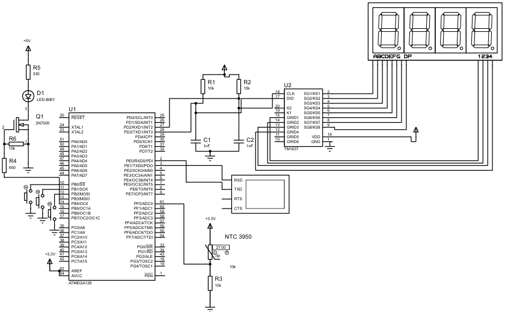

##ATmega128 Embedded Thermostat

A register-level, bare-metal embedded thermostat controller built on the ATmega128 AVR microcontroller. This project demonstrates direct hardware manipulation, custom bit-banged communication protocols, signal processing for sensor data, and non-blocking state machine design. The system is validated using a Proteus simulation environment.

## Hardware Architecture & Simulation

### Component Overview
*   **Microcontroller:** Microchip ATmega128 running at 8 MHz.
*   **Temperature Sensor:** NTC3950 Thermistor configured in a voltage divider circuit.
*   **Display:** TM1637 4-Digit 7-Segment LED Display.
*   **User Input:** 3x Hardware-debounced push buttons (Up, Down, Confirm).
*   **Actuator/Load Control:** Logic-level N-Channel MOSFET (e.g., 2N7000/IRLZ44N) driven by hardware PWM for heating element control.

---

## Core Engineering Logic

This project avoids high-level abstraction libraries (like standard Arduino libraries) in favor of direct register manipulation in C. 

### 1. Signal Processing & Temperature Acquisition
The system reads analog voltage from the NTC3950 thermistor using the ATmega128's internal ADC. Because raw ADC readings fluctuate due to electrical noise, the signal passes through an Infinite Impulse Response (IIR) low-pass filter before temperature conversion.

The filter is implemented via the following difference equation:
$$y[n] = 0.969 y[n-1] + 0.0155 x[n] + 0.0155 x[n-1]$$

Once smoothed, the resistance is calculated and converted to Celsius using the simplified Steinhart-Hart (Beta parameter) equation:
$$T = \left( \frac{1}{T_0} + \frac{1}{B} \ln\left(\frac{R}{R_0}\right) \right)^{-1}$$

### 2. Custom Bit-Banged Display Protocol
Communication with the TM1637 display is handled via a custom bit-banging driver on `PORTD`. 
*   The driver manually toggles the Clock (CLK) and Data (DIO) lines with precise microsecond delays.
*   Data transmission mimics an $I^2C$-like protocol (Start condition, 8-bit data frame, ACK clock pulse, Stop condition) without relying on the microcontroller's hardware TWI/I2C peripheral, allowing the display to be routed to any standard GPIO pins.

### 3. Non-Blocking State Machine
To ensure the system remains responsive without relying on CPU-halting `delay()` functions, global timing is managed by `Timer1` operating in CTC (Clear Timer on Compare Match) mode, generating a $1\text{ms}$ tick.

The user interface and operational flow are governed by a deterministic state machine:
*   **State 0 & 1 (Menu & Time):** Configures the heating duration (countdown timer).
*   **State 2 (Temperature):** Sets the target thermal threshold and saves the setpoint to non-volatile EEPROM memory.
*   **State 3 (Active Run):** Executes the heating loop, multiplexing the display to show real-time temperature and remaining time. 

### 4. Load Control & Hysteresis
The MOSFET is driven by `Timer0` configured in Fast PWM mode on pin `PB4`. To prevent mechanical relay chatter and excessive switching losses on the MOSFET, the thermostat utilizes an asymmetric hysteresis band rather than raw proportional control. 
*   If the current temperature drops $1^\circ\text{C}$ below the target, the MOSFET is driven to 100% duty cycle.
*   Once the exact target is reached, the MOSFET is fully disabled (0% duty cycle). 

---

## MCU Pin Mapping

| Peripheral Component | ATmega128 Pin | Port/Register Role |
| :--- | :--- | :--- |
| **TM1637 CLK** | `PD2` | General Purpose Output |
| **TM1637 DIO** | `PD3` | General Purpose Output |
| **Button: UP** | `PB0` | Input with Internal Pull-up |
| **Button: DOWN** | `PB1` | Input with Internal Pull-up |
| **Button: CONFIRM** | `PB2` | Input with Internal Pull-up |
| **MOSFET Gate** | `PB4` | `OC0` (Timer0 PWM Output) |
| **NTC3950 Sensor** | `PF0` | `ADC0` (Analog to Digital) |

---

## Toolchain & Compilation
*   **Environment:** Atmel Studio / Microchip Studio
*   **Compiler:** AVR-GCC
*   **Simulation:** Proteus Design Suite
